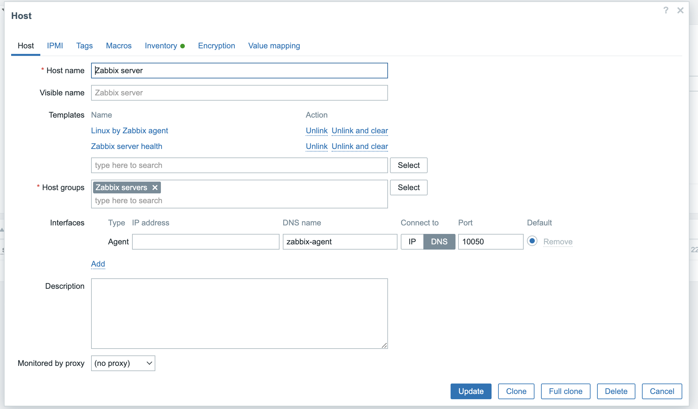

# Zabbix Service

This is a simple service to monitor the status of the Zabbix server and the Zabbix agent.

## Requirements

- Docker desktop installed on the machine or a docker engine running on the machine.
- Docker-compose installed on the machine.


## Installation

1. clone the repository and cd repository folder:
2. make a secrets folder and create two txt files inside

 ```bash
    mkdir secrets
    echo "my_mysql_password" > secrets/mysql_root_password.txt
    echo "my_zabbix_password" > secrets/mysql_zabbix_password.txt
 ```

3. run the following command to install the service:

```bash
bash setup.sh
```

it will build the docker image and run the service.

## Usage

The service will be running on the following ports:

- zabbix-server: 10051
- zabbix-web: 8080
- zabbix-agent: 10050
- mysql: 3306

## Access

- in your browser type: http://[your ip machine]:8080
- Login with the following default credentials:
    - username: Admin
    - password: zabbix

## Config Agent

- in the zabbix web interface go to
 ```
 Monitoring -> Hosts -> Select Zabbix server -> Configuration -> Host
 ```
- Delete ip 127.0.0.1 and add DNS name "zabbix-agent" (container name), change to DNS instead of IP and use port 10050

